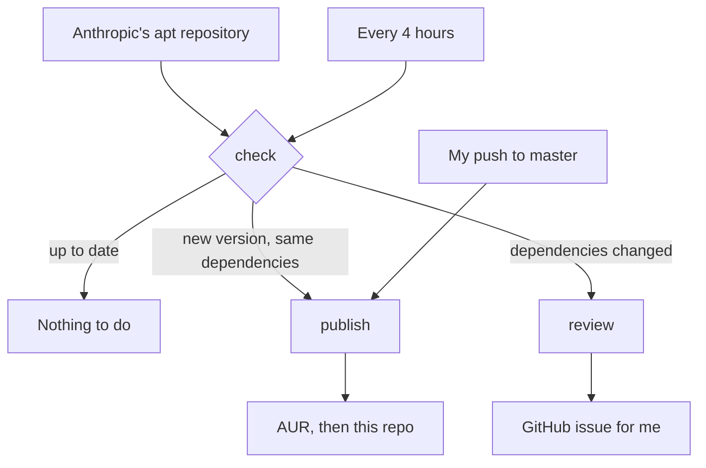

# claude-desktop

Arch Linux package for [Claude Desktop](https://claude.com/download), Anthropic's official desktop app. It's on the AUR as [claude-desktop](https://aur.archlinux.org/packages/claude-desktop).

Anthropic only ships Claude Desktop for Linux as a Debian package. This package takes that `.deb` and installs it the Arch way: dependencies translated to Arch package names, a launcher that runs natively on Wayland, and the few path fixes Cowork needs on Arch.

This is an unofficial package. I'm not affiliated with Anthropic.

## Install

```sh
paru -S claude-desktop
```

Any other AUR helper works too, like `yay -S claude-desktop`.

## How updates work

Anthropic releases new versions often. To keep the package current, updates are automated with GitHub Actions:



Every 4 hours, the workflow compares the newest version in Anthropic's apt repository with the one in this repo. When there's a new release, it also compares the release's dependencies (`Pre-Depends`, `Depends`, `Recommends` and `Suggests`, for both amd64 and arm64) with the current version's.

- If nothing changed, it updates the PKGBUILD, builds the package in a clean Arch container, checks it with namcap, and pushes it to the AUR.
- If something changed, it opens an issue instead. A dependency change needs a person to decide what it means on Arch, so those releases wait for me.

When I push a change myself, like a fix for a flagged release or a launcher edit, the same build and checks run before it reaches the AUR.

## Running the check yourself

```sh
./scripts/check-update.sh
```

It prints the new version if there is one, and exits with:

| Code | Meaning |
|---|---|
| 0 | New version, dependencies unchanged |
| 1 | Something went wrong |
| 3 | Nothing to do |
| 4 | New version, dependencies changed |

`--apply` writes the new version and checksums into the PKGBUILD and regenerates `.SRCINFO`. It only does that on exit code 0, unless you also pass `--reviewed`.

## Files

- `PKGBUILD`, `.SRCINFO` and `claude-desktop.sh` are the package. They're the only files that go to the AUR.
- `scripts/check-update.sh` finds new releases and compares dependencies.
- `.github/workflows/update.yml` is the workflow.
- `.github/aur_known_hosts` pins the AUR's SSH host keys.

## Issues

Packaging problems go here or on the AUR page. Problems with the app itself go to Anthropic.
